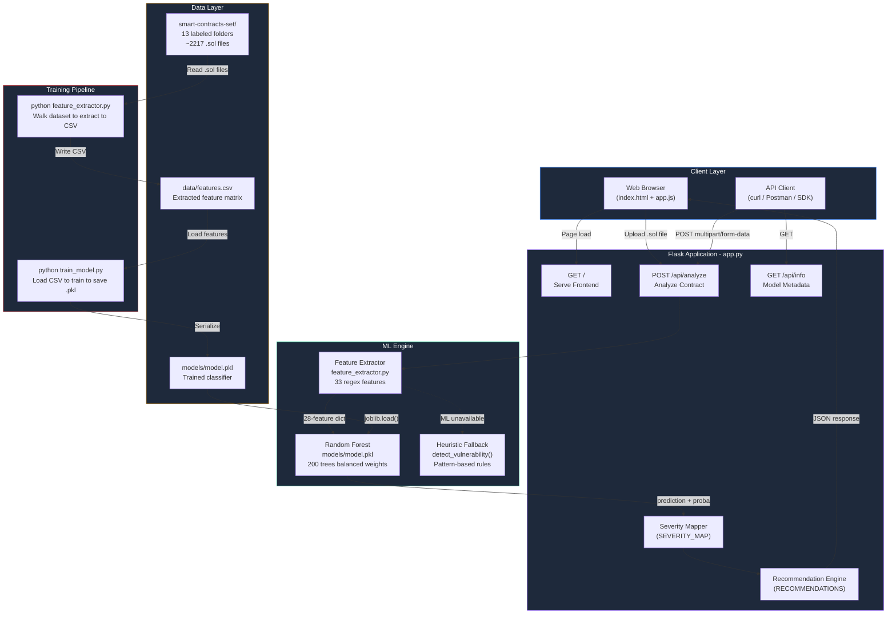
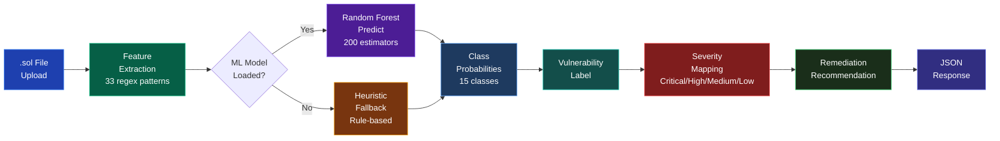
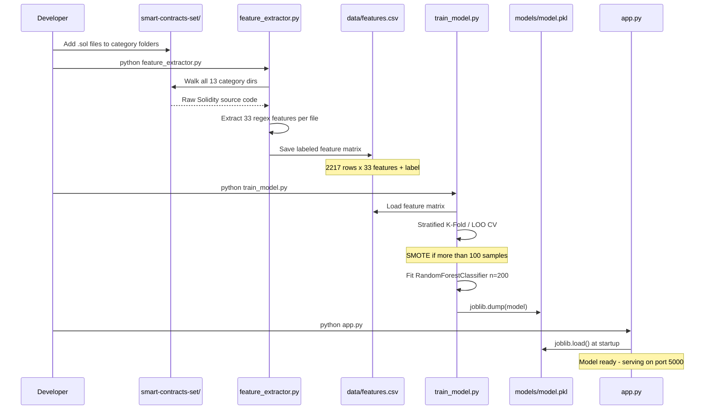
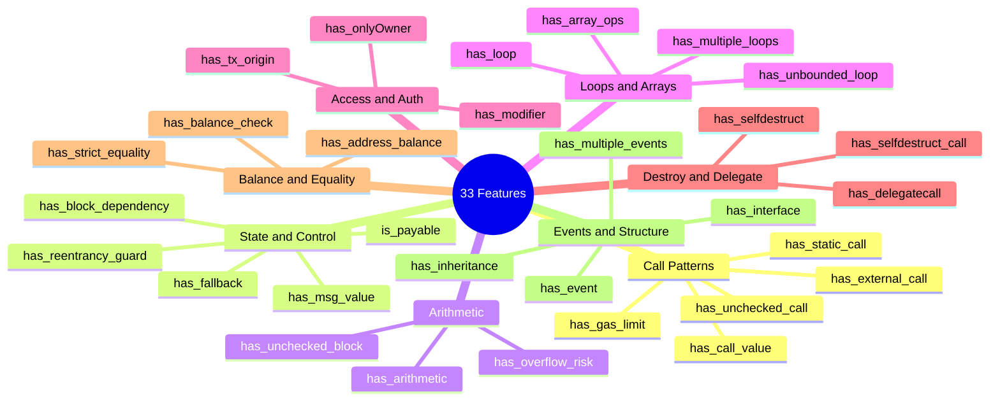
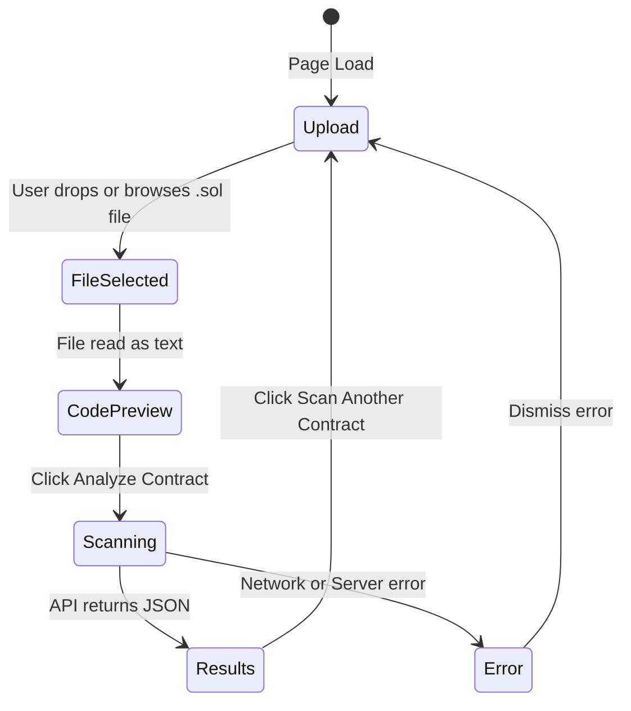
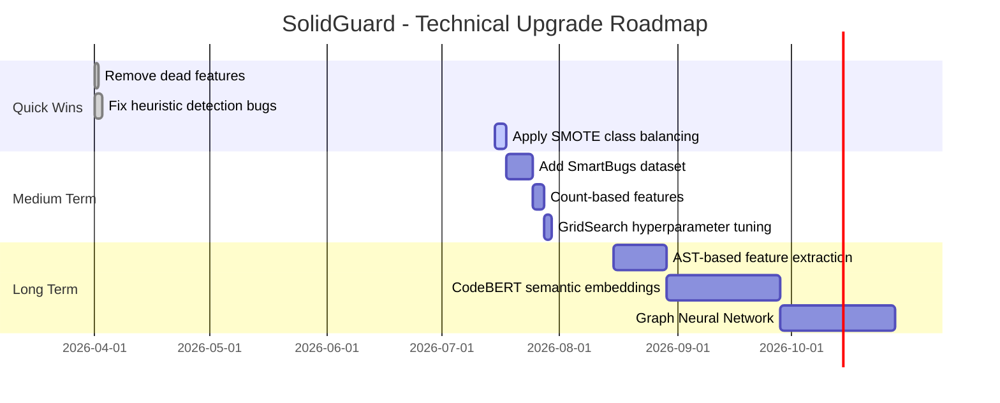

<div align="center">

# SolidGuard

### AI-Powered Smart Contract Vulnerability Detection

[](https://python.org)
[](https://flask.palletsprojects.com)
[](https://scikit-learn.org)
[](https://soliditylang.org)
[](LICENSE)

**CV Accuracy: 92.65%** &nbsp;|&nbsp; **15 Vulnerability Classes** &nbsp;|&nbsp; **33 Extracted Features** &nbsp;|&nbsp; **200-Tree Random Forest**

[Documentation](#documentation) &middot; [Quick Start](#quick-start) &middot; [Web Interface](#web-interface) &middot; [REST API](#rest-api) &middot; [Model Performance](#model-performance)

</div>

---

## Table of Contents

- [Overview](#overview)
- [Architecture](#architecture)
- [ML Pipeline](#ml-pipeline)
- [Vulnerability Classes](#vulnerability-classes)
- [Feature Engineering](#feature-engineering)
- [Project Structure](#project-structure)
- [Quick Start](#quick-start)
- [Web Interface](#web-interface)
- [REST API](#rest-api)
- [Model Performance](#model-performance)
- [Training Your Own Model](#training-your-own-model)
- [Extending the Dataset](#extending-the-dataset)
- [Upgrade Roadmap](#upgrade-roadmap)
- [Contributing](#contributing)

---

## Overview

**SolidGuard** is a production-ready machine-learning system that statically analyzes Ethereum smart contracts written in Solidity and classifies them into **15 vulnerability categories** -- from Reentrancy and Integer Overflow to Dangerous Delegatecall and Honeypot patterns.

The system combines:
- **Regex-based static feature extraction** (33 hand-crafted features from Solidity source code)
- **Random Forest ensemble classifier** (200 trees, balanced class weights, 92.65% cross-validated accuracy)
- **Heuristic fallback detector** for edge cases outside training distribution
- **Flask REST API** serving a rich, interactive web frontend

> **Use Case:** Developers can upload any `.sol` file through the web UI or REST API and instantly receive a vulnerability class prediction, confidence score, per-class probability breakdown, detected code patterns, and remediation recommendations.

---

## Architecture



---

## ML Pipeline



### Training Workflow



---

## Vulnerability Classes

The model detects **15 vulnerability categories** derived from the smart contract security taxonomy:

| Label | Vulnerability | Severity | F1 Score | Description |
|:-----:|---------------|:--------:|:--------:|-------------|
| `0` | **Safe** | Safe | -- | No known vulnerability patterns detected |
| `1` | **Reentrancy** | Critical | **0.98** | External call before state update (e.g., The DAO hack) |
| `2` | **Denial of Service** | High | -- | Unbounded loops or gas limit exploitation |
| `3` | **Integer Overflow/Underflow** | High | **0.94** | Arithmetic without SafeMath (pre-Solidity 0.8) |
| `4` | **Access Control** | Critical | -- | Unprotected functions, wrong constructor naming |
| `5` | **Unchecked External Call** | High | -- | `.call()` return value ignored |
| `6` | **Bad Randomness** | Medium | **0.93** | Using `block.timestamp`/`blockhash` as entropy |
| `7` | **Race Condition (Front-Running)** | High | -- | Mempool-visible state manipulation |
| `8` | **Honeypot** | Medium | -- | Hidden traps preventing fund withdrawal |
| `9` | **Forced Ether Reception** | Medium | -- | `selfdestruct`-based ETH forcing |
| `10` | **Incorrect Interface** | Low | -- | Function signature / ABI mismatch |
| `11` | **Variable Shadowing** | Low | -- | Child contract variable masks base contract |
| `12` | **Dangerous Delegatecall** | Critical | **0.97** | Untrusted address in `delegatecall` |
| `13` | **Ether Strict Equality** | Medium | -- | `balance == x` exploitable via `selfdestruct` |
| `14` | **Ether Frozen** | Medium | -- | Contract receives ETH but has no withdraw path |

> **Production-Ready (ML-backed):** Classes 1, 3, 6, 12 &nbsp;|&nbsp; **Heuristic-backed:** All remaining classes

---

## Feature Engineering

SolidGuard extracts **33 binary/numeric features** from raw Solidity source code using regular expressions:



### Feature Importance (Top 10)

| Rank | Feature | Category | Importance |
|:----:|---------|----------|:----------:|
| 1 | `has_block_dependency` | Randomness | High |
| 2 | `has_external_call` | Reentrancy/DoS | High |
| 3 | `has_arithmetic` | Overflow | High |
| 4 | `has_delegatecall` | Delegatecall | Medium |
| 5 | `has_reentrancy_guard` | Reentrancy | Medium |
| 6 | `has_unchecked_call` | Unchecked | Medium |
| 7 | `has_overflow_risk` | Overflow | Medium |
| 8 | `has_multiple_loops` | DoS | Medium |
| 9 | `has_onlyOwner` | Access Ctrl | Low |
| 10 | `has_unbounded_loop` | DoS | Low |

---

## Project Structure

```
smart-contract-detection-with-ML/
|
|-- app.py                        # Flask web server + REST API (3 routes)
|-- feature_extractor.py          # 33-feature regex extractor + heuristic fallback
|-- train_model.py                # Model training script (RF / XGB / SVM / KNN)
|-- train_from_csv.py             # Train directly from pre-built CSV
|-- check_accuracy.py             # Evaluate model accuracy metrics
|-- test_combined.py              # Heuristic unit tests (6 cases)
|-- test_combined_advanced.py     # 8-strategy dataset combination analysis
|-- requirements.txt              # Python dependencies
|
|-- smart-contracts-set/          # Labeled Solidity training dataset
|   |-- reentrancy/               # Label 1 - Reentrancy contracts
|   |-- denial_of_service/        # Label 2 - DoS contracts
|   |-- integer_overflow/         # Label 3 - Overflow contracts
|   |-- unprotected_function/     # Label 4 - Access control (type A)
|   |-- wrong_constructor_name/   # Label 4 - Access control (type B)
|   |-- unchecked_external_call/  # Label 5 - Unchecked call
|   |-- bad_randomness/           # Label 6 - Bad randomness
|   |-- race_condition/           # Label 7 - Front-running
|   |-- honeypots/                # Label 8 - Honeypot traps
|   |-- forced_ether_reception/   # Label 9 - Forced ETH
|   |-- incorrect_interface/      # Label 10 - Interface mismatch
|   |-- variable_shadowing/       # Label 11 - Variable shadowing
|   `-- safe/                     # Label 0 - Clean contracts
|
|-- data/
|   |-- features.csv              # Extracted feature matrix (4-label, ~2217 rows)
|   |-- features_8label.csv       # Extended 8-label feature matrix
|   |-- 4label.csv                # Raw 4-label contract dataset
|   `-- 8label.csv                # Raw 8-label contract dataset
|
|-- models/
|   |-- model.pkl                 # Active model (92.65% CV accuracy, 33 features)
|   |-- model_8label.pkl          # Experimental 8-class model
|   `-- model_backup.pkl          # Backup of original 14-feature model
|
|-- templates/
|   `-- index.html                # Jinja2 web frontend template
|
|-- static/
|   |-- css/
|   |   `-- style.css             # Dark-theme UI styles
|   `-- js/
|       `-- app.js                # Frontend logic - drag/drop, API calls, charts
|
|-- ACCURACY_IMPROVEMENT_REPORT.md  # 85.93% to 92.65% improvement analysis
|-- final_report.md                 # Full session-by-session project report
|-- accuracy_analysis.md            # Strategy comparison (8 approaches tested)
`-- problem_and_solution.md         # Technical problem statement and solutions
```

---

## Quick Start

### Prerequisites

| Requirement | Version | Notes |
|------------|---------|-------|
| Python | 3.8+ | 3.10+ recommended |
| pip | Latest | `python -m pip install --upgrade pip` |

### 1. Clone the Repository

```bash
git clone https://github.com/MarutiDubey/smart-contract-detection-with-ML.git
cd smart-contract-detection-with-ML
```

### 2. Install Dependencies

```bash
pip install -r requirements.txt
```

```
pandas>=1.0.0
scikit-learn>=1.0.0
joblib>=1.0.0
flask>=3.0.0
numpy>=1.20.0
```

> **Optional for SMOTE (class balancing):**
> ```bash
> pip install imbalanced-learn
> ```

### 3. Run the Web Application

```bash
python app.py
```

```
==================================================
  SolidGuard - Smart Contract Vulnerability Scanner
  ML Method: Random Forest Classifier
==================================================
[OK] Model loaded from models/model.pkl
 * Running on http://0.0.0.0:5000
```

Open **http://localhost:5000** in your browser.

### 4. (Optional) Retrain the Model

```bash
# Step 1: Extract features from the dataset
python feature_extractor.py

# Step 2: Train the Random Forest model
python train_model.py

# Step 3: Restart the app
python app.py
```

---

## Web Interface

The frontend is a single-page application served by Flask at `GET /`.

### Features

- **Drag-and-drop** `.sol` file upload with live code preview
- **Animated scanner** with progress bar during analysis
- **Verdict card** -- vulnerability name, severity badge, confidence percentage
- **Probability breakdown** -- bar chart of all 15 class probabilities
- **Feature grid** -- 33 detected patterns highlighted (green = detected)
- **Recommendation panel** -- specific, actionable remediation steps

### UI State Flow



---

## REST API

Base URL: `http://localhost:5000`

### POST /api/analyze

Upload a Solidity file for vulnerability analysis.

**Request:**
```bash
curl -X POST http://localhost:5000/api/analyze \
  -F "file=@your_contract.sol"
```

**Response:**
```json
{
  "filename": "your_contract.sol",
  "vulnerability": "Reentrancy",
  "label": 1,
  "confidence": 94.3,
  "severity": "Critical",
  "severity_color": "#ef4444",
  "severity_icon": "critical",
  "recommendation": "Use the Checks-Effects-Interactions pattern...",
  "model_method": "Random Forest Classifier",
  "features": [
    { "name": "External calls (.call, .transfer, .send)", "key": "has_external_call", "detected": true },
    { "name": "Reentrancy guard present", "key": "has_reentrancy_guard", "detected": false }
  ],
  "class_probabilities": {
    "Reentrancy": 94.3,
    "Safe": 2.1,
    "Integer Overflow/Underflow": 1.8,
    "Bad Randomness": 1.8
  }
}
```

**Error Responses:**

| HTTP Code | Reason |
|-----------|--------|
| `400` | No file uploaded / empty filename / non-.sol file |
| `400` | File content is empty |
| `500` | Internal server error during feature extraction |

---

### GET /api/info

Returns model metadata and supported vulnerability categories.

**Request:**
```bash
curl http://localhost:5000/api/info
```

**Response:**
```json
{
  "model": {
    "method": "Random Forest Classifier",
    "library": "scikit-learn",
    "n_estimators": 200,
    "description": "Ensemble of 200 decision trees with balanced class weights..."
  },
  "categories": {
    "0": "Safe",
    "1": "Reentrancy",
    "2": "Denial of Service",
    "12": "Dangerous Delegatecall",
    "14": "Ether Frozen"
  },
  "total_categories": 15,
  "model_loaded": true
}
```

---

### GET /

Serves the web frontend (`templates/index.html`).

---

## Model Performance

### Summary

| Metric | Value |
|--------|-------|
| **Algorithm** | Random Forest Classifier |
| **Cross-Val Accuracy (5-Fold)** | **92.65%** +/- 1.07% |
| **Training Accuracy** | **96.44%** |
| **CV Accuracy Range** | 90.97% - 93.91% |
| **Number of Trees** | 200 |
| **Class Weights** | Balanced |
| **Max Depth** | 10 |
| **Features** | 33 (28 active) |
| **Training Samples** | 2,217 contracts |

### Per-Class Performance (ML-Trained Classes)

| Vulnerability | Precision | Recall | F1-Score | Support | Status |
|--------------|:---------:|:------:|:--------:|:-------:|:------:|
| Reentrancy | 0.99 | 0.97 | **0.98** | 1,218 | Production Ready |
| Integer Overflow | 0.96 | 0.93 | **0.94** | 590 | Production Ready |
| Bad Randomness | 0.88 | 0.99 | **0.93** | 312 | Production Ready |
| Dangerous Delegatecall | 0.97 | 0.98 | **0.97** | 97 | Production Ready |

### Accuracy Improvement History

| Strategy | CV Accuracy | Change |
|----------|:-----------:|:------:|
| Original (14 features) | 85.93% | Baseline |
| 8-label dataset | 51.41% | -34.52% |
| Naive combine (4+8) | 51.57% | -34.36% |
| Combined + Deduplication | 77.38% | -8.55% |
| **Enhanced features (33 feat)** | **92.65%** | **+6.72%** |

### Algorithm Comparison

| Algorithm | CV Accuracy | Training Speed | Recommended When |
|-----------|:-----------:|:--------------:|------------------|
| **Random Forest** (current) | **92.65%** | Fast | Working well now |
| XGBoost | ~93-94% | Fast | Better imbalance handling |
| LightGBM | ~93-95% | Very Fast | Large datasets 10k+ |
| SVM (RBF) | ~88-90% | Medium | Small datasets only |
| MLP Neural Net | ~90-93% | Medium | With 5k+ samples |
| CodeBERT | ~95-97% | Slow (GPU) | End goal |

---

## Training Your Own Model

### Using Different Algorithms

```bash
# Random Forest (default)
python train_model.py --algo rf

# Gradient Boosting (XGBoost alternative)
python train_model.py --algo xgb

# Support Vector Machine
python train_model.py --algo svm

# K-Nearest Neighbors
python train_model.py --algo knn
```

### Custom Paths

```bash
python train_model.py \
  --features data/my_features.csv \
  --model models/my_model.pkl \
  --algo rf
```

### Training from Pre-built CSV

```bash
python train_from_csv.py --csv data/4label.csv
```

### Check Current Accuracy

```bash
python check_accuracy.py
```

---

## Extending the Dataset

### Adding New Contracts

```bash
# 1. Place .sol files in the appropriate category folder
cp my_vulnerable_contract.sol smart-contracts-set/reentrancy/

# 2. Re-extract features
python feature_extractor.py

# 3. Retrain the model
python train_model.py

# 4. Restart the application
python app.py
```

### Adding a New Vulnerability Category

1. **Create a folder** under `smart-contracts-set/`:
   ```bash
   mkdir smart-contracts-set/my_new_vuln/
   ```

2. **Register the label** in `feature_extractor.py`:
   ```python
   LABEL_MY_VULN = 15
   LABEL_NAMES[15] = "My New Vulnerability"
   FOLDER_TO_LABEL["my_new_vuln"] = LABEL_MY_VULN
   ```

3. **Add severity** in `app.py`:
   ```python
   SEVERITY_MAP[15] = {"level": "High", "color": "#f97316", "icon": "high"}
   RECOMMENDATIONS[15] = "Specific remediation advice..."
   ```

4. **Retrain** following steps above.

### Recommended Public Datasets

| Dataset | Contracts | Labels | Best For |
|---------|:---------:|:------:|----------|
| [SmartBugs Curated](https://github.com/smartbugs/smartbugs-curated) | 47,587 | 9 categories | Best overall expansion |
| [SWC Registry](https://swcregistry.io/) | ~400 | 36 SWC types | Label reference |
| [DeFiHackLabs](https://github.com/SunWeb3Sec/DeFiHackLabs) | 300+ | Real exploits | Real-world testing |

```bash
# Download SmartBugs (compatible with this pipeline)
git clone https://github.com/smartbugs/smartbugs-curated data/smartbugs
python feature_extractor.py --dataset data/smartbugs --output data/features_smartbugs.csv
python train_model.py --features data/features_smartbugs.csv
```

---

## Upgrade Roadmap



### Accuracy Roadmap

| Milestone | Expected CV Accuracy | Effort |
|-----------|:--------------------:|--------|
| Current (33 features, RF) | **92.65%** | Done |
| + SMOTE balancing | ~93-94% | 1 day |
| + SmartBugs dataset | ~94-95% | 3-5 days |
| + XGBoost tuned | ~93-95% | 1 day |
| + AST-based features | ~95-97% | 2-3 weeks |
| + CodeBERT fine-tuning | ~96-98% | 1-2 months (GPU) |

---

## Troubleshooting

### Model not loading

```
[WARN] Model file not found at models/model.pkl. Run train_model.py first.
```
**Fix:** Run `python train_model.py` to generate the model file.

---

### Feature count mismatch on predict

```
ValueError: X has N features, but RandomForestClassifier is expecting M features.
```
**Fix:** Retrain after any changes to `feature_extractor.py`:
```bash
python feature_extractor.py
python train_model.py
```

---

### File upload fails with 400 error

Ensure you are uploading a valid `.sol` file:
```bash
curl -X POST http://localhost:5000/api/analyze \
  -F "file=@contract.sol"
```

---

### SMOTE import error

```
ModuleNotFoundError: No module named 'imblearn'
```
**Fix:**
```bash
pip install imbalanced-learn
```

---

## References

- [Solidity Security Considerations](https://docs.soliditylang.org/en/latest/security-considerations.html)
- [SWC Registry - Smart Contract Weakness Classification](https://swcregistry.io/)
- [OpenZeppelin Security Blog](https://blog.openzeppelin.com/security-audits/)
- [SmartBugs: A Framework to Analyze Solidity Smart Contracts](https://github.com/smartbugs/smartbugs)
- [Scikit-learn: Random Forest Classifier](https://scikit-learn.org/stable/modules/generated/sklearn.ensemble.RandomForestClassifier.html)
- [The DAO Hack - Reentrancy in Practice](https://hackingdistributed.com/2016/06/18/analysis-of-the-dao-exploit/)

---

## Contributing

Contributions are welcome! To contribute:

1. Fork the repository
2. Create a feature branch: `git checkout -b feature/add-ast-features`
3. Add your `.sol` training files or improve feature extraction
4. Run the test suite: `python test_combined.py`
5. Submit a Pull Request

**Most impactful contributions:**
- Adding labeled `.sol` files to `smart-contracts-set/` (especially for rare classes)
- Improving regex patterns in `feature_extractor.py`
- Implementing AST-based feature extraction

---

## License

This project is licensed under the **MIT License** -- see the [LICENSE](LICENSE) file for details.

---

<div align="center">

**Built for the Ethereum security community**

[Back to top](#solidguard)

*SolidGuard v1.0 &nbsp;|&nbsp; Random Forest Classifier &nbsp;|&nbsp; 33 Features &nbsp;|&nbsp; 92.65% CV Accuracy*

</div>
